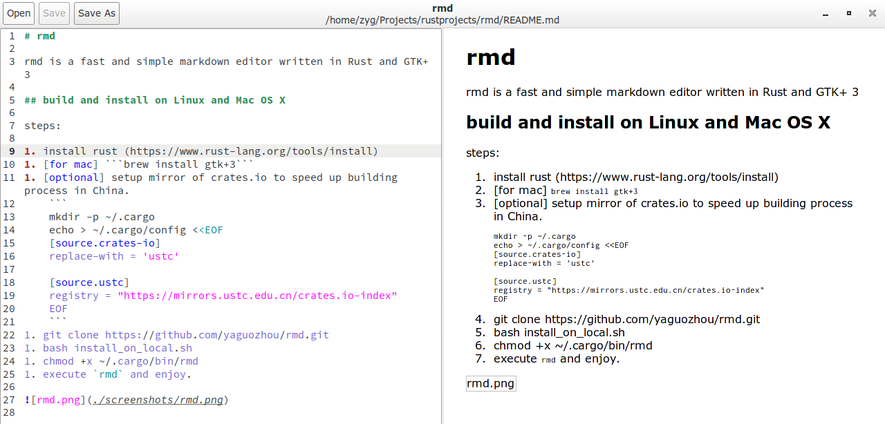

# rmd

rmd is a fast and simple markdown editor written in Rust and GTK+ 3

## build and install on Linux and Mac OS X

steps:

1. install rust (https://www.rust-lang.org/tools/install)
1. [for mac] ```brew install gtk+3```
1. [optional] setup mirror of crates.io to speed up building process in China.
    ```
    mkdir -p ~/.cargo
    echo > ~/.cargo/config <<EOF
    [source.crates-io]
    replace-with = 'ustc'
    
    [source.ustc]
    registry = "https://mirrors.ustc.edu.cn/crates.io-index"
    EOF
    ```
1. git clone https://github.com/abstractsuperman/rmd.git
1. bash install_on_local.sh
1. chmod +x ~/.cargo/bin/rmd
1. execute `rmd` and enjoy.

